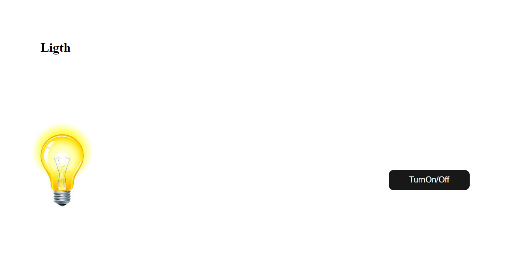

# Projeto JavaScript

## 🚀 Lampada

#### Funcionalidades

- [X] Acende Lampada ao passar o cursor do mouse.
- [X] Apaga Lampada ao retirar o cursor do mouse da imagem.
- [X] Quebra a Lampada com duplo click sobre a imagem.
- [X] O Botão**[`Turn on/off`]()** muda de posição a cada vez que o cursor do mousa se aproxima.

## **🚀 Base do Projeto**

* [X] JavaScript.
* [X] CSS.
* [X] HTML.

## **🚀 Imagem do Projeto**

